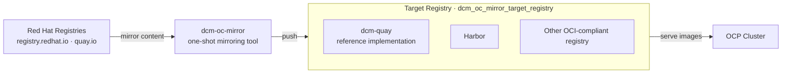
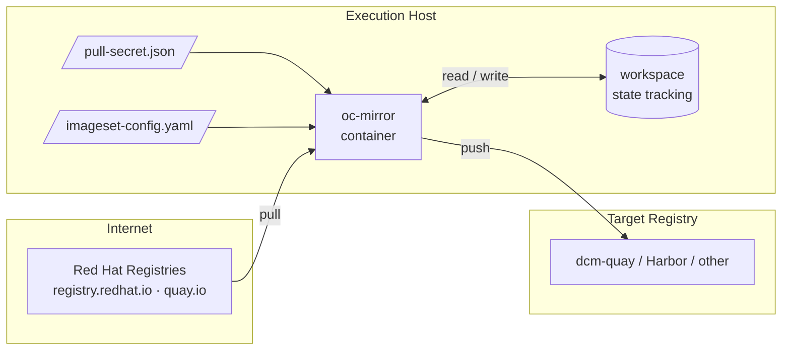
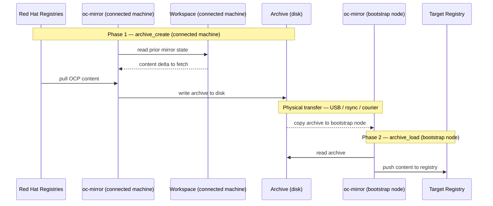

# dcm-oc-mirror

Reference implementation for mirroring OpenShift Container Platform (OCP) content into a
disconnected registry using
[oc-mirror](https://docs.openshift.com/container-platform/latest/installing/disconnected_install/installing-mirroring-disconnected.html).

Part of the [dcm-bootstrap](https://github.com/heatmiser/dcm-bootstrap) stack. Feeds content
into a local registry for use by an OCP cluster in a disconnected environment. The target
registry is fully configurable — [dcm-quay](https://github.com/heatmiser/dcm-quay) is the
reference implementation, but any OCI-compliant registry such as Harbor is supported.

`dcm-oc-mirror` is a one-shot tool — it runs, mirrors content, and exits. It does not deploy
any persistent services or Quadlet units.

## Architecture

The following diagram shows the role of `dcm-oc-mirror` in the dcm-bootstrap stack.



The target registry is identified by `dcm_oc_mirror_target_registry`. Changing this variable
is the only configuration required to switch from dcm-quay to Harbor or any other registry.

## Operating Modes

Three modes are supported, controlled by the `dcm_oc_mirror_mode` variable:

| Mode | When to use | Runs on |
| --- | --- | --- |
| `direct` | Bootstrap node has transient connectivity to Red Hat registries | Bootstrap node |
| `archive_create` | True air-gap — package content on a connected machine | Connected machine |
| `archive_load` | True air-gap — load a transferred archive into the local registry | Bootstrap node |

## Direct Mode

The bootstrap node pulls content from Red Hat registries and pushes directly to the target
registry. Requires outbound connectivity to `registry.redhat.io` and `quay.io`.



The workspace persists mirror state between runs. On Day 2 and beyond, only content that has
changed since the last run is pulled and pushed — not the full catalog.

### Day 1

1. Set `dcm_oc_mirror_mode: direct` (the default) in `vars/oc-mirror.yml`
2. Set `dcm_oc_mirror_target_registry` to your registry hostname and port
3. Configure `dcm_oc_mirror_ocp_version`, operators, and additional images
4. Place a pull secret at `dcm_oc_mirror_pull_secret_path` containing credentials for both
   Red Hat registries and your target registry (see [Pull Secret](#pull-secret))
5. Run the playbook:

   ```bash
   ansible-playbook -i inventory playbooks/site.yml
   ```

### Day 2

Update `dcm_oc_mirror_ocp_version` or add entries to `dcm_oc_mirror_operators` or
`dcm_oc_mirror_additional_images` in `vars/oc-mirror.yml`, then re-run the playbook.
The workspace tracks prior state and ensures only the delta is mirrored.

## Archive Mode

For environments with no network path from the bootstrap node to Red Hat registries, content
is packaged on a connected machine and physically transferred.



### Phase 1 — archive_create (connected machine)

#### Day 1

1. Set `dcm_oc_mirror_mode: archive_create` in `vars/oc-mirror.yml`
2. Configure `dcm_oc_mirror_ocp_version`, operators, and additional images
3. Place a Red Hat pull secret at `dcm_oc_mirror_pull_secret_path`
4. Run the playbook:

   ```bash
   ansible-playbook -i inventory playbooks/site.yml
   ```

   Content is written to `dcm_oc_mirror_archive_dir`.

#### Day 2

Re-run the same playbook. The workspace on the connected machine tracks what was previously
archived — only new or changed content is written to the archive on subsequent runs.

### Transfer

Copy `dcm_oc_mirror_archive_dir` to the bootstrap node by any available method — USB drive,
`rsync` over a one-time link, or physical media courier.

The archive directory path on the bootstrap node must match `dcm_oc_mirror_archive_dir` in
`vars/oc-mirror.yml`, or override the variable to match the destination path.

### Phase 2 — archive_load (bootstrap node)

#### Day 1 and Day 2

1. Set `dcm_oc_mirror_mode: archive_load` in `vars/oc-mirror.yml`
2. Set `dcm_oc_mirror_target_registry` to your registry hostname and port
3. Confirm `dcm_oc_mirror_archive_dir` points to the transferred archive
4. Place a pull secret at `dcm_oc_mirror_pull_secret_path` containing credentials for the
   target registry (Red Hat registry credentials are not required in this mode)
5. Run the playbook:

   ```bash
   ansible-playbook -i inventory playbooks/site.yml
   ```

## Prerequisites

### Pull Secret

The pull secret at `dcm_oc_mirror_pull_secret_path` is a standard Docker auth configuration
file. It must contain credentials for:

- **Red Hat registries** (`registry.redhat.io`, `quay.io`) — required for `direct` and
  `archive_create` modes to pull OCP content. Obtain from
  [console.redhat.com](https://console.redhat.com/openshift/install/pull-secret).
- **Target registry** — required for `direct` and `archive_load` modes to push content.

To add target registry credentials to an existing pull secret:

```bash
podman login --authfile /path/to/pull-secret.json registry.example.com:8443
```

This merges the new credentials into the existing file without overwriting Red Hat entries.

### TLS

If the target registry uses a private CA or a self-signed certificate, the oc-mirror container
must trust it. The recommended approach is to mount the CA certificate into the container by
extending `tasks/run_mirror.yml` with an additional `-v` argument pointing to the certificate
file at `/etc/pki/ca-trust/source/anchors/` inside the container.

For internal-network deployments where strict TLS verification is not required, oc-mirror
supports `--dest-tls-verify=false`. Add this flag to the `argv` list in `tasks/run_mirror.yml`
for the relevant modes.

### Target Registry

The target registry must be running and reachable before executing `direct` or `archive_load`
mode. When using dcm-quay as the target, ensure the dcm-quay stack is fully started before
running this playbook.

## Image-mode Filesystem Considerations

When running on an image-mode (bootc) system such as dcm-bootstrap, the placement of
`dcm_oc_mirror_workspace_dir`, `dcm_oc_mirror_config_dir`, and `dcm_oc_mirror_archive_dir`
determines whether their contents survive two distinct events: container image updates and
bootc system upgrades. The default paths are intentional — this section explains why and
provides guidance for operators who need to override them.

### How the bootc filesystem works

Image-mode RHEL uses a composefs root. On every bootc upgrade, `/usr` is replaced with the
content of the new image. `/var` is never touched by the upgrade mechanism — it is a live,
fully writable filesystem that persists across reboots, upgrades, and the entire operational
life of the system.

The phrase "seeded once" in bootc documentation refers only to what bootc does at initial
install: content baked into `/var` in the Containerfile is written to the live `/var`
partition one time. After that, `/var` is a normal writable filesystem. Services, containers,
and playbooks read and write it freely — Day 1, Day 2, and every subsequent run.

On image-mode RHEL, `/srv` is a symlink to `/var/srv`. The default paths
(`/srv/containers/oc-mirror/...`) therefore resolve to `/var/srv/containers/oc-mirror/...`
and inherit all the persistence and writability of `/var`.

### Survival across both update events

| Event | Effect on workspace, config, and archive directories |
| --- | --- |
| dcm-oc-mirror container image update | No effect — directories are volume-mounted from the host at runtime; the container image contains only the oc-mirror binary |
| bootc system upgrade | No effect — directories are under `/var` (via `/srv` → `/var/srv`); bootc never modifies `/var` during an upgrade |
| Day 2 and subsequent mirror runs | Directories are fully writable at runtime — oc-mirror accumulates workspace state across every run, enabling incremental mirroring |

### Path selection guidance

Operators overriding the default paths must choose locations that are mutable at runtime and
persistent across upgrades. On image-mode systems:

| Path prefix | Image-mode behavior | Suitable |
| --- | --- | --- |
| `/var/` | Mutable at runtime, persistent — never touched by bootc upgrade | Yes |
| `/srv/` → `/var/srv/` | Mutable at runtime, persistent — symlink into `/var` (default) | Yes |
| `/usr/` | Immutable composefs — replaced on every upgrade | No |
| `/opt/` | Immutable composefs — replaced on every upgrade | No |
| `/etc/` | Mutable, but subject to 3-way merge on upgrade — corrupts binary state files | No |
| `/tmp/` or `/run/` | Ephemeral — cleared on reboot | No |

The workspace directory must survive across runs for incremental mirroring to function
correctly. Placing it under `/tmp` or `/run` causes oc-mirror to treat every execution as
a first run and re-mirror the full catalog, which is both slow and produces oversized archives
in `archive_create` mode.

## Variables Reference

| Variable | Default | Description |
| --- | --- | --- |
| `dcm_oc_mirror_mode` | `direct` | Operating mode: `direct`, `archive_create`, or `archive_load` |
| `dcm_oc_mirror_image` | `quay.io/s4v0/dcm-oc-mirror` | Container image for oc-mirror |
| `dcm_oc_mirror_image_tag` | `latest` | Container image tag |
| `dcm_oc_mirror_workspace_dir` | `/srv/containers/oc-mirror/workspace` | oc-mirror state tracking directory — persist between runs |
| `dcm_oc_mirror_config_dir` | `/srv/containers/oc-mirror/config` | Directory for the rendered imageset-config.yaml |
| `dcm_oc_mirror_archive_dir` | `/srv/containers/oc-mirror/archives` | Archive output (`archive_create`) or input (`archive_load`) directory |
| `dcm_oc_mirror_pull_secret_path` | `/srv/containers/oc-mirror/pull-secret.json` | Path to Docker auth configuration file |
| `dcm_oc_mirror_ocp_version` | `4.16` | OCP version to mirror |
| `dcm_oc_mirror_ocp_channel` | `stable-{{ dcm_oc_mirror_ocp_version }}` | OCP update channel |
| `dcm_oc_mirror_target_registry` | `registry.example.com:8443` | Target registry hostname and port |
| `dcm_oc_mirror_operators` | `[]` | List of operator catalogs and packages to mirror |
| `dcm_oc_mirror_additional_images` | `[]` | List of additional image references to mirror |
